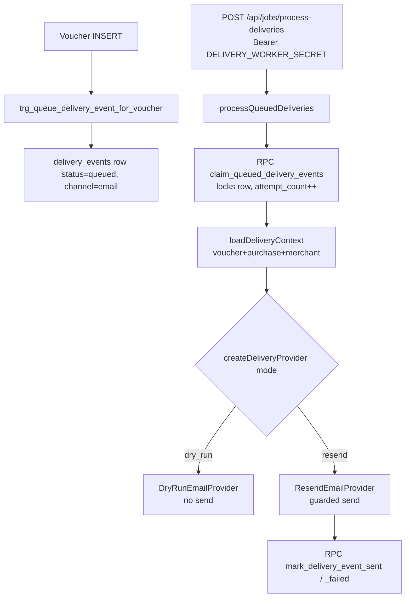

# Slice 8b.11 - Guarded Real-Email Delivery Validation (Validation PASS)

> Status: Validation PASS. No code, no SQL, no package changes, no commits.
> Scope: Gift-card email delivery validation via Resend, test-recipient only.
> Out of scope: WhatsApp Business API, buyer/merchant alert emails, platform-alert
> Resend validation (that is slice 8b.12).

## 1. Executive Summary

The gift-card email delivery layer is fully built and supports both `dry_run`
and `resend` modes. The `resend` path is wired end-to-end (provider, factory,
route guard, RPCs, DB queue) and has now been validated safely with a test
recipient only. A strong, multi-layer **test-recipient guardrail exists in code**:
when `RESEND_ALLOW_REAL_RECIPIENTS !== 'true'`, every email is force-redirected to
`RESEND_TEST_RECIPIENT`, never the real recipient.

**No new code or SQL was required to validate real Resend delivery to a test
recipient.** Validation was an environment-flip plus a single-worker invocation.
The only external prerequisite was a Resend account with a verified sending
domain matching `RESEND_FROM_EMAIL` (an infra/DNS task, not a code task). The
safe path was: keep `RESEND_ALLOW_REAL_RECIPIENTS=false`, set
`DELIVERY_WORKER_MODE=resend`, ensure exactly one `queued` email `delivery_events`
row existed, and invoke the worker once with `batchSize=1`.

## 2. Current Delivery Architecture

Flow: voucher issued -> DB trigger enqueues audit row -> worker endpoint claims ->
orchestrator loads context -> provider sends -> RPC marks result.



Key files:

- `src/app/api/jobs/process-deliveries/route.ts` — auth + mode gate + Resend config preflight
- `src/lib/delivery/delivery-orchestrator.ts` — claim/send/mark loop
- `src/lib/delivery/delivery-context.ts` — hydrates email content data
- `src/lib/delivery/providers/factory.ts` - mode -> provider
- `src/lib/delivery/providers/resend-email-provider.ts` - **the guardrail lives here**
- `src/lib/delivery/providers/dry-run-email-provider.ts` - no-op send
- `src/lib/delivery/email-template.ts` - ES/EN HTML+text, HTML-escaped
- DB migrations:
  - `supabase/migrations/20260610165000_queue_delivery_event_on_voucher_insert.sql`
  - `supabase/migrations/20260611203000_harden_delivery_events_for_worker.sql`
  - `supabase/migrations/20260611210000_create_claim_queued_delivery_events_rpc.sql`
  - `supabase/migrations/20260611213000_create_complete_delivery_event_rpcs.sql`

## 3. Env / Guardrail Inventory (no secret values)

**Provider(s):** Two - `DryRunEmailProvider` (default, no send) and
`ResendEmailProvider` (real send). Email channel only; WhatsApp/SMS/PDF are out of
scope and not implemented as senders.

| Variable | Role | Notes |
|---|---|---|
| `DELIVERY_WORKER_ENABLED` | Master on/off | Must be `true` or endpoint returns 503 |
| `DELIVERY_WORKER_SECRET` | Bearer auth for endpoint | Server-only; never log |
| `DELIVERY_WORKER_MODE` | `dry_run / resend` | Selects provider |
| `DELIVERY_WORKER_BATCH_SIZE` | Rows per run | Set to `1` for validation |
| `RESEND_API_KEY` | Resend auth | Server-only; never log |
| `RESEND_FROM_EMAIL` | Verified sender | Must match a verified Resend domain |
| `RESEND_REPLY_TO_EMAIL` | Optional reply-to | — |
| `RESEND_TEST_RECIPIENT` | **Guardrail sink** | All mail goes here unless real allowed |
| `RESEND_ALLOW_REAL_RECIPIENTS` | **Kill-switch** | Only `'true'` enables real-recipient sends |

**Guardrail behavior:** `RESEND_TEST_RECIPIENT` exists and a real-recipient guard
exists. In `resend-email-provider.ts`:

```ts
const realRecipientAllowed = process.env.RESEND_ALLOW_REAL_RECIPIENTS === 'true';
const sentToTestRecipient = !realRecipientAllowed;
const recipient = realRecipientAllowed ? input.recipientContact : testRecipient!;
```

It is strict-equality against the string `'true'` (default-deny). If real is not
allowed and no test recipient is set, it returns `resend_test_recipient_required`
and sends nothing. The route also preflights the same condition before invoking the
orchestrator. `provider_response` records `realRecipientAllowed` and
`sentToTestRecipient` for auditability.

### Validation evidence

- Worker mode: `resend`
- Claimed: `1`
- Processed: `1`
- Sent: `1`
- Failed: `0`
- Delivery event id: `3c53fcf8-0b1d-40ae-8ad3-fa9a383dd66a`
- Provider: `resend`
- `sentToTestRecipient`: `true`
- `realRecipientAllowed`: `false`
- Provider message id: recorded in `delivery_events.provider_message_id`
- Failure reason: `null`

### Validation note

`thelexlaw.com` was used only as a temporary verified sender domain for technical
validation. ParaUsted-owned sender domain verification is still required before any
pilot or production use.

### Product note

Email is the primary delivery rail. The voucher page remains the source of truth.
For MVP fallback, support manual WhatsApp share and a simple print/download fallback
from the voucher page in a separate slice.

## 4. Exact Safe Validation Plan

Goal: prove a real Resend email reaches the **test recipient** with
`realRecipientAllowed=false`.

1. **Infra prerequisite (one-time, outside this repo):** verify a sending domain in
  Resend that matches `RESEND_FROM_EMAIL` (existing runbook:
  `docs/architecture/integration-specs/resend-production-domain-setup-runbook.md`).
  Resend rejects sends from unverified domains.
2. **Set local env** (in `.env.local`, do not commit): `DELIVERY_WORKER_ENABLED=true`,
  `DELIVERY_WORKER_MODE=resend`, `DELIVERY_WORKER_BATCH_SIZE=1`,
  `RESEND_ALLOW_REAL_RECIPIENTS=false`, valid `RESEND_API_KEY`, `RESEND_FROM_EMAIL`,
  `RESEND_TEST_RECIPIENT` (a mailbox you control), `DELIVERY_WORKER_SECRET`.
3. **Confirm exactly one eligible row** exists (`status='queued'`, `channel='email'`,
  `attempt_count < max_attempts`, not locked). If none, issue/confirm one test
  voucher whose purchase `delivery_method='email'` so the trigger enqueues it. Use a
  non-production / local Supabase project.
4. **Invoke the worker once** with `batchSize:1`.
5. **Verify:** the email lands in the test mailbox; the DB row shows `status='sent'`,
  a `provider_message_id`, and `provider_response` with `provider='resend'`,
  `sentToTestRecipient=true`, `realRecipientAllowed=false`.
6. **Record evidence** in the existing template
  `docs/architecture/integration-specs/resend-production-domain-test-evidence.md`
  (placeholders only - no secrets, no real addresses).
7. **Leave `RESEND_ALLOW_REAL_RECIPIENTS=false`** afterward.

This validated real provider connectivity, domain auth (SPF/DKIM), template
rendering, idempotency key, and the mark-sent RPC - without any risk to real
recipients (fully validatable test-recipient-only).

## 5. Required DB / Query Checks (read-only `SELECT`)

Run before invoking, to confirm one eligible row and avoid surprises:

```sql
-- Eligible queued email events
SELECT id, merchant_id, status, attempt_count, max_attempts, locked_at, next_attempt_at
FROM delivery_events
WHERE channel = 'email' AND status = 'queued'
ORDER BY queued_at DESC LIMIT 10;
```

After invoking, confirm result + guardrail held:

```sql
SELECT id, status, provider_message_id, sent_at,
       provider_response ->> 'provider'             AS provider,
       provider_response ->> 'sentToTestRecipient'  AS sent_to_test,
       provider_response ->> 'realRecipientAllowed' AS real_allowed
FROM delivery_events
WHERE channel = 'email'
ORDER BY COALESCE(sent_at, queued_at) DESC LIMIT 5;
```

Safety assertion (must return 0 rows): the "Real Recipient Safety Check" query in the
evidence doc.

**Exact state to process one email:** a `delivery_events` row with `channel='email'`,
`status='queued'`, `attempt_count < max_attempts`, `next_attempt_at` null-or-past,
`locked_at` null-or-stale, with linked `vouchers` (code, original_amount_cents),
`purchases` (recipient_name, sender_name, personal_message, currency), and `merchants`
(name) rows resolvable by the context loader.

## 6. Required Local Commands (one at a time)

> Use a local/dev Supabase + a Resend test API key. Do not run against production data.

1. Confirm worker config is loaded (non-secret presence check only):

```powershell
node -e "console.log({ enabled: process.env.DELIVERY_WORKER_ENABLED, mode: process.env.DELIVERY_WORKER_MODE, realAllowed: process.env.RESEND_ALLOW_REAL_RECIPIENTS })"
```

2. Start the app:

```powershell
npm run dev
```

3. Invoke the worker once (type the secret directly; do not echo it):

```powershell
curl.exe -X POST http://localhost:3001/api/jobs/process-deliveries -H "Authorization: Bearer <DELIVERY_WORKER_SECRET>" -H "Content-Type: application/json" -d '{\"batchSize\":1}'
```

(SQL checks from §5 run separately in the Supabase SQL editor / `psql`.)

## 7. Risks & Mitigations

| Risk | Mitigation |
|---|---|
| Accidental real-recipient send | Keep `RESEND_ALLOW_REAL_RECIPIENTS=false`; code force-redirects to test recipient; post-run safety query must return 0 rows |
| Sending from unverified domain - failure or spam | Complete domain setup runbook first; verify SPF/DKIM/DMARC |
| Processing more rows than intended | `batchSize:1` + confirm only one queued row beforehand |
| Secret leakage in logs | Never echo `RESEND_API_KEY`/`DELIVERY_WORKER_SECRET`; logs already mask and avoid PII |
| Running against prod data | Use local/dev Supabase project and a Resend test key |
| Double send on retry | Idempotency key + `mark_*` RPCs require `status='queued'`; claim locks the row |

## 8. Is Implementation Needed Before Validation?

**No code and no SQL changes were required.** Everything needed was implemented:

- Resend provider + guardrail
- Mode selection + route preflight
- Claim/mark RPCs and queue trigger
- ES/EN escaped templates
- Evidence template

The only **non-code** prerequisite was a verified Resend sending domain matching
`RESEND_FROM_EMAIL`. A temporary verified sender domain on `thelexlaw.com` was
used only for technical validation. ParaUsted-owned sender domain verification is
still required before any pilot or production use.

## 8.1 Product Note

Email is the primary delivery rail. The voucher page remains the source of truth.
For MVP fallback, support manual WhatsApp share and a simple print/download fallback
from the voucher page in a separate slice.

## 9. What Must NOT Be Touched

- `RESEND_ALLOW_REAL_RECIPIENTS` - leave `false` for this slice.
- Append-only tables: `ledger_entries`, `audit_events`, `security_events`, `redemptions`.
- The guardrail logic in `resend-email-provider.ts` and the route preflight.
- The claim/mark RPCs and the voucher-insert trigger.
- Production data / production Resend keys.
- Platform-alert Resend path and WhatsApp - explicitly out of scope (8b.12 covers
  platform-alert validation).

## 10. Validation PASS Evidence Summary

- Worker mode: `resend`
- Claimed: `1`
- Processed: `1`
- Sent: `1`
- Failed: `0`
- Delivery event id: `3c53fcf8-0b1d-40ae-8ad3-fa9a383dd66a`
- Provider: `resend`
- `sentToTestRecipient`: `true`
- `realRecipientAllowed`: `false`
- Provider message id: recorded in `delivery_events.provider_message_id`
- Failure reason: `null`

## 11. Recommended Next Action

No further implementation is needed for this slice. For the next launch step,
confirm ParaUsted-owned sender domain verification is in place before any pilot or
production use, and keep the temporary validation domain limited to technical tests.
