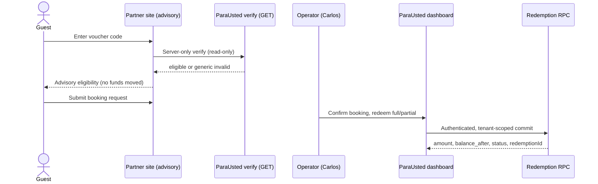

# Redemption & Partner API Architecture

**Status:** Current
**Updated:** 2026-07-13
**Scope:** Voucher verification and redemption across the merchant dashboard and the machine-to-machine (M2M) partner API.

---

## 1. Ownership boundary

ParaUsted is the single source of truth for voucher money state. Partner sites (e.g. Seville Tours) are acquisition and advisory surfaces only.

| Concern | Owner |
|---|---|
| Voucher issuance, balance, status, expiry | ParaUsted |
| Redemption commit (full and partial) | ParaUsted |
| Ledger, audit, refunds | ParaUsted |
| Read-only eligibility check | ParaUsted (exposed to partners) |
| Discovery, booking UX, brand | Partner site |
| Operator commit action | ParaUsted merchant dashboard |

Partner sites never hold a voucher balance, never persist a redemption ledger, and never expose a public commit path.

---

## 2. Surfaces

### 2.1 Merchant dashboard (authenticated session)

```
POST /api/vouchers/{code}/redeem
```

- Auth: Supabase merchant session (`auth.getUser()`); `merchant_id` resolved from `auth.uid()` inside the RPC.
- Body: `{ notes?: string, amountCents?: integer_cents_positive }`.
- `amountCents` absent → full remaining balance; present → partial.
- Rate limit: 30/min per authenticated user.
- RPCs: `redeem_voucher_full` / `redeem_voucher_partial` (`SECURITY DEFINER`, `GRANT authenticated`).
- Errors: per-state and specific by design (see §4).

### 2.2 Partner verify (read-only, M2M)

```
GET /api/partner/vouchers/{code}
```

- Auth: `Authorization: Bearer <partner-token>`; hashed lookup resolves exactly one `merchant_id`; scope `voucher:read`.
- Rate limit: 120/min per key. A `429` response carries a `Retry-After` header (seconds) so partners back off correctly.
- RPC: `verify_voucher_for_merchant` (`STABLE`, `SECURITY DEFINER`, service-role only).
- No mutation, no PII. Generic `invalid_or_not_found` for every ineligible/unknown/cross-tenant voucher.

### 2.3 Partner redeem (commit, M2M)

```
POST /api/partner/vouchers/{code}/redeem
```

- Auth: Bearer partner token; scope `voucher:redeem`.
- Headers: optional `Idempotency-Key` (≤255 chars).
- Body: `{ amountCents?, partnerReference?, notes? }`.
- Rate limit: 60/min per key. A `429` response carries a `Retry-After` header (seconds).
- RPCs: `redeem_voucher_full_for_merchant` / `redeem_voucher_partial_for_merchant` (`SECURITY DEFINER`, service-role only).
- Idempotency persisted on `redemptions.idempotency_key`, unique per `(merchant_id, key)`.

---

## 3. Redemption RPC invariants

All four redemption RPCs share these guarantees:

1. **Tenant scope** — `merchant_id` comes from the session (`auth.uid()`) or the resolved partner key, never from the client.
2. **Atomicity** — `SELECT ... FOR UPDATE` row lock plus a compare-and-set (`balance_cents = v_balance_before`) update. A losing concurrent writer receives `already_processed`.
3. **Append-only** — every redemption inserts one `redemptions` row and one `audit_events` row; no `UPDATE`/`DELETE` of history.
4. **State gates** — reject `redeemed`, `expired`, `voided`, `exchanged`, and non-redeemable statuses.
5. **Money bounds (partial)** — `amount_cents > 0` (`invalid_amount`) and `amount_cents <= balance` (`amount_exceeds_balance`); `balance_after = balance_before - amount` is always `>= 0`.
6. **Status transition** — `partially_redeemed` when a remainder remains, else `redeemed`.
7. **Integer cents only** — no floating-point money anywhere in the path.

---

## 4. Error exposure model

| Surface | Error style | Rationale |
|---|---|---|
| Merchant dashboard | Specific per-state | Authenticated and tenant-scoped; the merchant owns the voucher and needs the reason. Cross-tenant/unknown collapses to `not_found`. |
| Partner verify | Generic (`invalid_or_not_found`) | Prevents voucher enumeration by a partner integration. |
| Partner redeem | Specific per-state | Trusted M2M caller. **Must not** be proxied verbatim to a public browser; the partner collapses them to generic guest copy. |
| Public voucher page `/v/{code}` | Shows status to code holder | The high-entropy code is the bearer credential; holding it implies possession of the gift. |

---

## 5. Idempotency & reconciliation

- **Partner path**: caller supplies a stable `Idempotency-Key` (preferred) or `partnerReference`. Same key + same voucher → replay prior result (`replay: true`, same `redemptionId`). Same key + different voucher → `idempotency_conflict`.
- **Merchant dashboard**: partial redemption sends a stable per-intent client idempotency key (`redeem_voucher_partial`), so a duplicate submit replays the prior result instead of double-redeeming; the key rotates after success and resets on code/amount change. Full redemption is intentionally key-less (a repeat fails safely with `already_redeemed`).
- **Reconciliation**: same-key replay is the authoritative recovery for ambiguous timeouts. There is currently no read-only redemption-by-reference lookup endpoint.

---

## 6. Data flow (end-to-end, partner booking)



---

## 7. Related migrations

- `20260609114236_create_redeem_voucher_rpc.sql` — merchant full redemption.
- `20260619120000_create_partner_api_keys_and_partner_redeem_rpc.sql` — partner keys + full M2M redemption.
- `20260621120000_scope_redemptions_idempotency_uniqueness.sql` — per-merchant idempotency uniqueness.
- `20260713000003_add_partner_voucher_verification.sql` — read-only partner verification + `voucher:read` scope.
- `20260713000004_add_partner_partial_redemption.sql` — partial M2M redemption.
- `20260713000005_add_merchant_partial_redemption.sql` — partial dashboard redemption.
